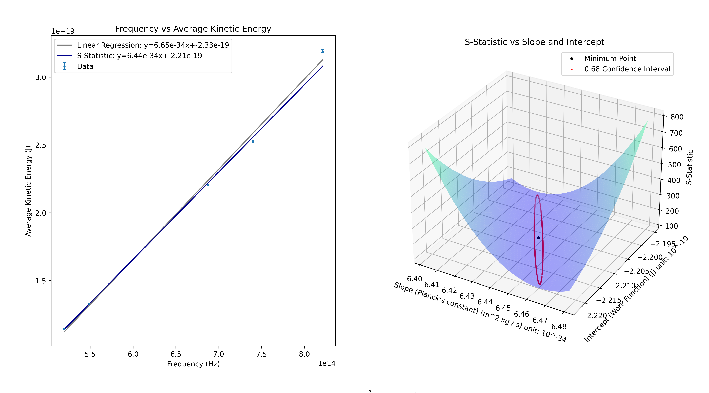

# Photoelectricity Lab
My graphing and calculations for the lab.
## Usage:
### Data:
- Must be in CSV format with name `data.csv`.
- Must have at least 2 columns: `Wavelength` and `Voltage`. Wavelength must be in nm and voltage in volts including the negative sign.
- If you choose to include more voltages, they will be averaged. Name them `Voltage 1`, `Voltage 2`, etc.
- See `example.csv` for format, you *must* use that style.
### Prep:
- Place your data.csv in the same folder as `plots.py`.
- With python installed, run in the terminal, in the same directory as you cloned this repository to, `python3 -m pip install -r requirements.txt` to get the needed packages.
- Important: If scipy fails to install, you will need to do the following:
    - Install brew from [here](https://brew.sh/)
    - Use brew to install python: `brew install python3`
    - Use brew to install scipy: `brew install scipy`
- Run `python3 plots.py`
### Interpreting Results:
- The coefficient of y for both the linear regression and s-statistic models is the found value of Planck's constant. The added value is the negative work function.
## Sample:
